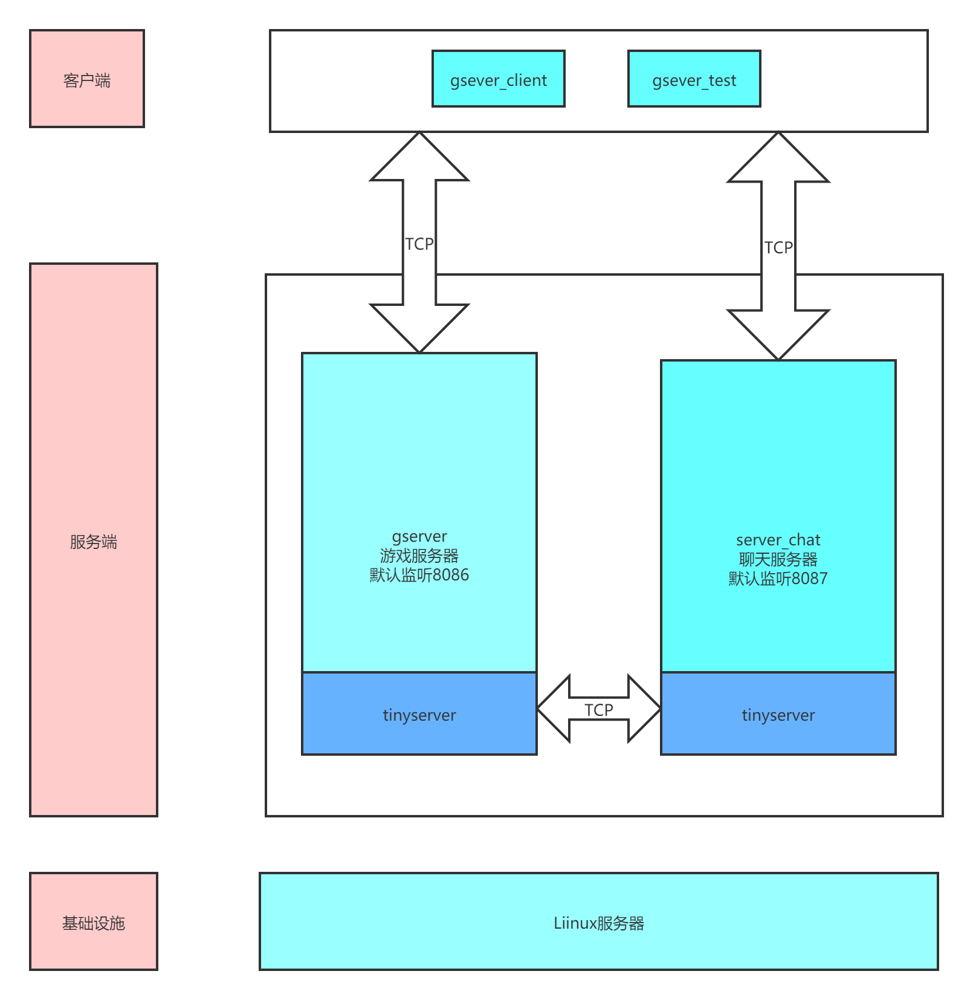

# 项目介绍

## 架构


## 编译运行
1. 仅支持Linux环境，需要已经安装Clang和CMake
2. 项目依赖tinyserver、google-protobuf
3. 在src/proto目录下，执行`sh protoc.sh`编译protobuf代码
4. 执行`sh build.sh`编译源代码，现在默认为debug版，可以执行`BUILD_TYPE=release ./build.sh`编译release版本
5. 编译没有报错，可执行文件会生成在debug/bin目录下，直接运行即可

### 代码目录结构
```
.
├── include                         依赖头文件
│   └── tinyserver                  依赖的tinyserver头文件
├── lib                             依赖的静态库
├── src                             项目源代码
│   ├── auth                        用户管理库代码，输出libgserver_auth.a
│   ├── ChatServer                  聊天程序代码，输出server_chat
│   ├── common                      通用库代码，输出libgserver_common.a
│   ├── gserver                     游戏程序代码，输出gserver
│   └── proto                       protobuf代码
└── wiki                            wiki内容
```